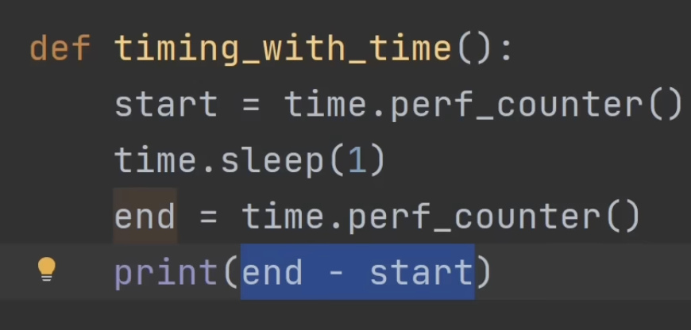
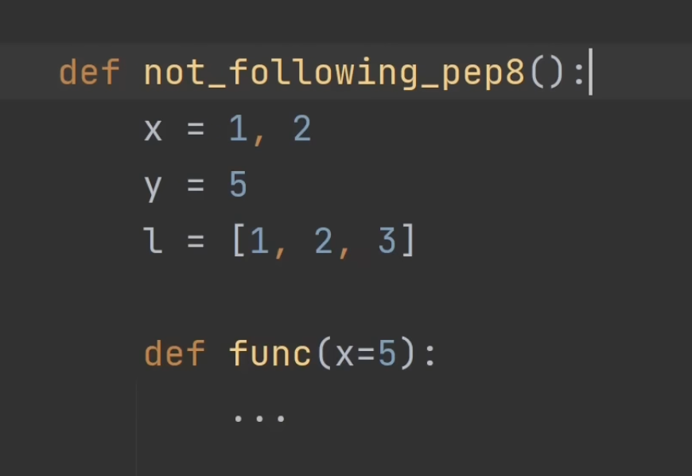
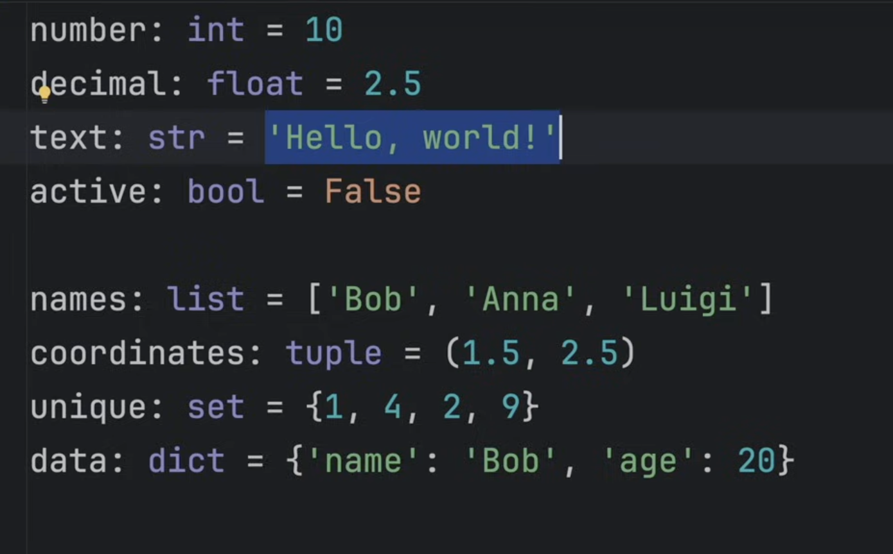
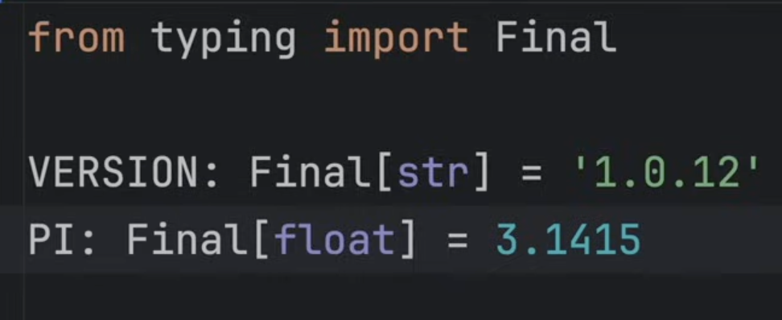
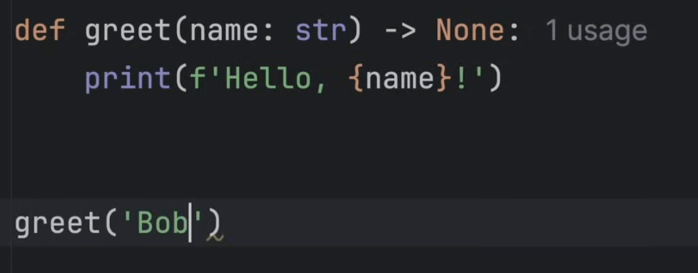
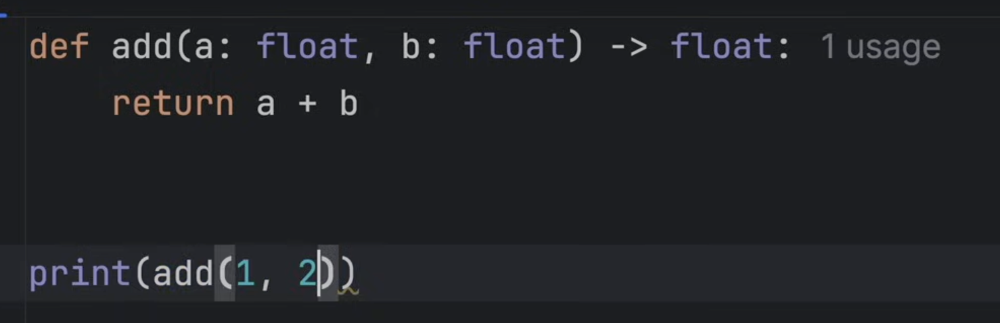
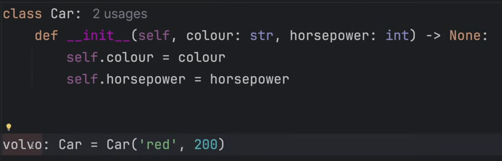
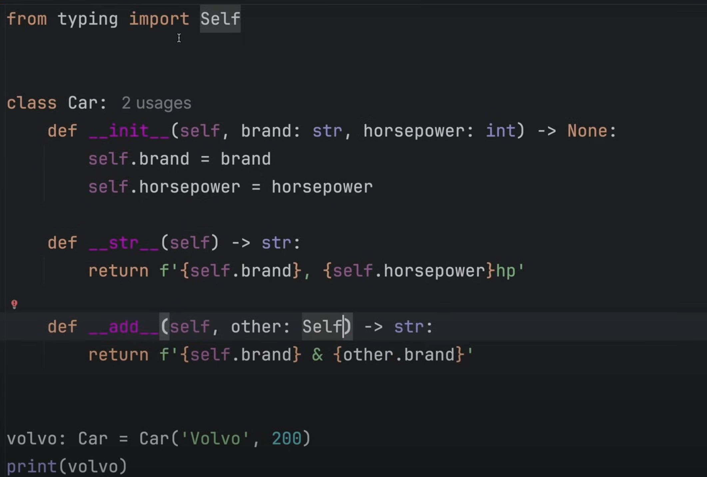

- `5 // 3` -> int(5/3)
- `x = input('Enter value: ')` -> input value by default converts inputs to string, so do int(x) or float(x)
- `type()` method

# string methods
- `.upper()`
- `.lower()`
- `.capitalize()`
- `.count()` - count how many times the specific substring occurs in the string
- `'hello'*3`
- cannot do this -> `'hello'+3` ❌

# misc.
- `ord(c)` get the ascii for character c

# List/Tuples
- `list1.extend([1, 2, 5, 3])` - loops through the input arguement and calls x.append for it
- `list1.pop(index)` - optional parameter, give the index to be removed

# looping misc.
- `range()` - a function that creates a collection of numbers based on the input
    - `range(start, stop, step)`:
    - `range(stop)`
    - `range(start,stop)`

- `slice` operator: allows you to take out a slice of a collection like a string, list, tuple and make it a new variable
    - `list1[start:stop:step]`

# sets
- Unordered unique collection of items
- extremely fast for lookup, deletion and addition
- use when you only care to keep track if something exists or doesn't exist, not for tracking frequency or order of items

## Initialization
- empty set -> `x = set()`
- otherwise -> `x = {1, 42, 2}`

## Methods
- `set1.add()`
- `set1.remove()`
- `x in set1`, extremely fast compared to `x in list1`: $$O(1)$$
- set1.union(set2), intersection, difference, symmetric difference, etc

# Dict or Hash Table or Map or key-value store

Also a fast lookup
```python
x = {
        'time': 23, 
        3:5231, 
        3.1:4.5, 
        True: 'no'
    }
x['key'] = 5
x[2] = [1, 3, 4]
```
- `'key2' in x`
- `list(x.values())` and `list(x.keys())`
```python
x = {
        'time': 23, 
        3:3, 
        3.1:4.5, 
        True: 'no'
    }
x['bird']=9.3
print(list(x.values()))
print(list(x.keys()))

# Output:
# [23, 3, 4.5, 'no', 9.3]
# ['time', 3, 3.1, True, 'bird']
```

- `del x['key']`
- `list(x.items())` -> returns a list of tuples of key, value, so
- `for key, val in x.items():`

# Comprehensions
- `x = [i for i in range(50) if i%5 == 0]`
- `x = ["yes" if i<10 else "no" for i in range(50) if i%5 == 0]`
- we can do these expansions for lists, tuples, sets, dictionaries:
    - `x = {i:i*i for i in range(10)}`
    - `x = {i**3 for i in range(5)}`
    - `x = tuple(i for i in range(5))` ❗️ Note because `x = (i for i in range(5))` returns a generator object

# Functions
```python
def func():
    print('run')
    def func2():
        print('inside')
    func2()
func()
```
- can return multiple items, which would be returned in a tuple which can be unpacked:
```python
def func():
    return 4, 5, 2, [12, 3, (3)]
x = func()[2]
# OR
w, x, y, z = func()
```
- functions are objects, which can be returned

```python
def func(x):
    def func2():
        print(x)
    return func2

x = func(3)     # x stores a function object
print(x)        # <function func.<locals>.func2 at 0x7efc0eb393a0>
x()             # calling the function
```

# ⭐️ unpack operator - `*`
It seperates all the elements from a collection into individual elements, 
```python
x = [1, 2, 3, 4]
print(*x)
# this will be equivalent to below code
print(x[0], x[1], x[2], x[3])
```
here is a great example:
```python
def func(x, y):
    print(x+y)

pairs = [(1, 2), (3, 4)]

for pair in pairs:
    func(pair[0], pair[1])  # ❌ Bad way to do this
    func(*pair)     # ✅ do this instead
    
```
⭐️ You can also use this `*` unpack operator on dicts as well, but you have to use `**`:
```python
def func(x, y):
    print(x+y)

func(**{'y': 5, 'x': 2})    # order of keys doesn't matter as long as the keys match the arguement names

a = 'x'
b = 'y'
func(**{a: 1, b: 4})
```
❗️ Note: you cannot have more or less keys in the dictionary as the entire dict is unpacked and passed to the func

# `*args` and `**kwargs`
So now that we understand `*` and `**` operators, we basically know how `*args` and `**kwargs` work

```python
def func(*args, **kwargs):
    print(args, kwargs)
    
func(1, 2, 3, 4, one='hello', two='world', three=2.9021)
# Output: (1, 2, 3, 4) {'one': 'hello', 'two': 'world', 'three': 2.9021}
```
Inside `func` you can then upack the args and kwargs into individual variables and use them

# Scope and globals
`global` keyword:

    - never use this, but its good to know
```python
x = 'orange'
def func(new_value):
    global x
    x = new_value

print(x)
func('apple')
print(x)
```

# Exceptions
## Raise Exceptions
```python
raise Exception("Something went wrong!")
# Output
Exception: Something went wrong!
    raise Exception("Something went wrong!")
Line 1 in <module> (Solution.py)

```
- this is a base class you can extend it and do more

## try catch
```python
try:
    x = 7/0
except Exception as e:
    print(e)
# continue on with the rest of the program
```

## try catch finally
```python
try:
    x = 7/0
except Exception as e:
    print(e)
finally:

```
`finally` - this block will run no matter what, usually does cleanup after whatever you did in try or except, for example you try to write to a file, some exception occured halfway but you still need to close the file so put that in finally.

# Lambda
- A one line anonymous function

for example:

`x = lambda x: x + 5`
`print(x(4))`
or
```python
x = lambda x, y: x + y

print(x(10, 30))
```

This is not a advisable way to use lambdas, see how they are used below, in the map and filter function:

`map(func, collection)` - `map()` will take all of the elements in a list and use a function to map them to a new value which makes a new list

```python
x = [1, 2, 3, 4, 5, 2, 4, 6, 2, 10, 3]
map_obj = map(lambda i: i+2, x)
print(list(map_obj))
```

`filter(boolean_func, iterable)` - in `filter()` the function passed to it maps each value to a boolean which implies whether to include the value in the new list 

```python
filter_obj = filter(lambda i: i%2 == 0, x)
print(list(filter_obj))

# OR

def func(i):
    i = 2*i + 3*math.sqrt(i+10)     # some extra logic
    return i%2==0
filter_obj = filter(func, x)
print(list(filter_obj))
```


# F strings
- only in python >= 3.6
```python
name='yash'
x = f'hello {6+8} {name}'
print(x)
```

# OOP
- every variable in python is an object of some class
- different between methods and function is that we need obj.method(), functions can be invoked directly

# Best Practices
1. Don't do manual string formatting with the `+` operator, instead use `f''` or f strings.
2. Don't manually close files, use `with`, because it will ensure the file is closed even if there is an exception
3. Any use of default mutable arguements, arguement defaults are defined when the function is defined not when its run, so if there is a default arguement like l=[], any function invocation which modifies l will persist.
4. instead of equality you should check for identity:
```python
if x is None:
    pass
if x is True:
    pass
if x is False:
    pass
```
5. use `enumerate` AND/OR `zip`
```python
a = [1, 2, 3]
b = [4, 5, 6]
for i, (av, bv) in enumerate(zip(a, b)):
    ...
```

6. Default dict loop is over keys, so just do:
`for key in dict1:
    ...`\
    also:
    `for k, v in dict.items():
    ...`

7. Don't use time.time() to measure how fast your code runs, instead use:


8. Learn pandas and numpy for any math operations
9. Learn how to use the built in logging library
10. know that python is compiled to the byte code level (not machine code level) and is then interpreted by the python interpreter
11. follow pep8


# Type Annotations in Python
these exist to show errors in the IDE, but even if you do something that violates the type rule the code won't give an error, these are just for the IDE to show errors due to mismatching types


# Constants
same as type annotations you can modify these and run, these only help in the IDE


# Better Functions

The above function returns nothing and accepts a string.






dunder methods for string representation of obj and adding two objects, and how to use type annotations in methods for objects of the same class using `Self` by importing `from typing import Self`

# 5 Good Python Habits
