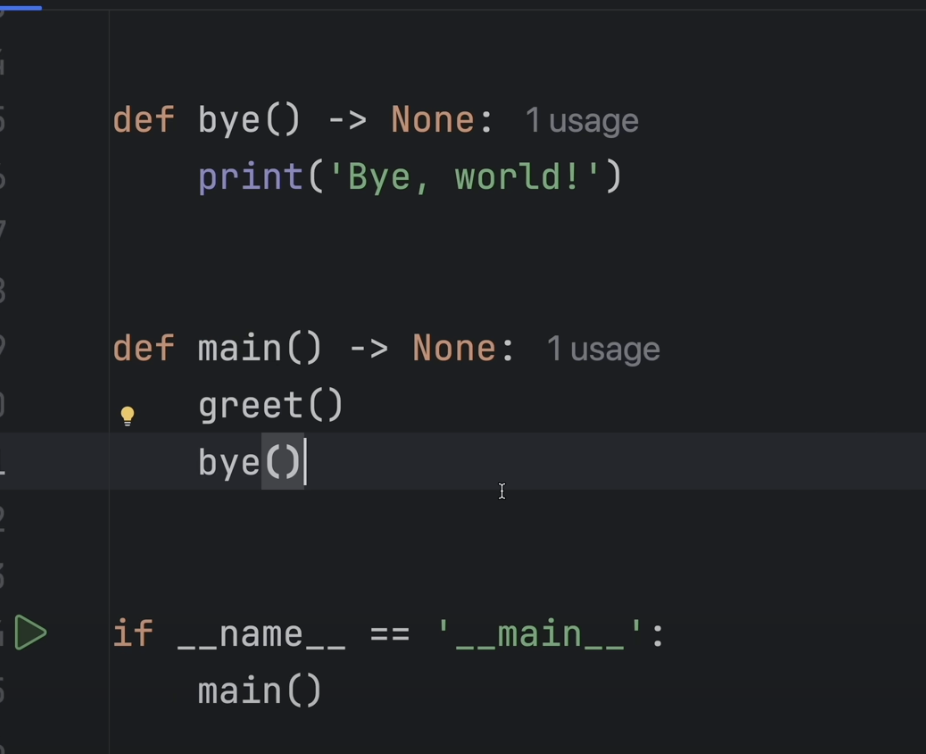

- `5 // 3` -> int(5/3)
- `x = input('Enter value: ')` -> input value by default converts inputs to string, so do int(x) or float(x)
- `type()` method

# string methods
- `.upper()`
- `.lower()`
- `.capitalize()`
- `.count()` - count how many times the specific substring occurs in the string
- `'hello'*3`
- cannot do this -> `'hello'+3` ❌

# misc.
- `ord(c)` get the ascii for character c

# List/Tuples
- `list1.extend([1, 2, 5, 3])` - loops through the input arguement and calls x.append for it
- `list1.pop(index)` - optional parameter, give the index to be removed

# looping misc.
- `range()` - a function that creates a collection of numbers based on the input
    - `range(start, stop, step)`:
    - `range(stop)`
    - `range(start,stop)`

- `slice` operator: allows you to take out a slice of a collection like a string, list, tuple and make it a new variable
    - `list1[start:stop:step]`

# sets
- Unordered unique collection of items
- extremely fast for lookup, deletion and addition
- use when you only care to keep track if something exists or doesn't exist, not for tracking frequency or order of items

## Initialization
- empty set -> `x = set()`
- otherwise -> `x = {1, 42, 2}`

## Methods
- `set1.add()`
- `set1.remove()`
- `x in set1`, extremely fast compared to `x in list1`: $$O(1)$$
- set1.union(set2), intersection, difference, symmetric difference, etc

# Dict or Hash Table or Map or key-value store

Also a fast lookup
```python
x = {
        'time': 23, 
        3:5231, 
        3.1:4.5, 
        True: 'no'
    }
x['key'] = 5
x[2] = [1, 3, 4]
```
- `'key2' in x`
- `list(x.values())` and `list(x.keys())`
```python
x = {
        'time': 23, 
        3:3, 
        3.1:4.5, 
        True: 'no'
    }
x['bird']=9.3
print(list(x.values()))
print(list(x.keys()))

# Output:
# [23, 3, 4.5, 'no', 9.3]
# ['time', 3, 3.1, True, 'bird']
```

- `del x['key']`
- `list(x.items())` -> returns a list of tuples of key, value, so
- `for key, val in x.items():`

# Comprehensions
- `x = [i for i in range(50) if i%5 == 0]`
- `x = ["yes" if i<10 else "no" for i in range(50) if i%5 == 0]`
- we can do these expansions for lists, tuples, sets, dictionaries:
    - `x = {i:i*i for i in range(10)}`
    - `x = {i**3 for i in range(5)}`
    - `x = tuple(i for i in range(5))` ❗️ Note because `x = (i for i in range(5))` returns a generator object

# Functions
```python
def func():
    print('run')
    def func2():
        print('inside')
    func2()
func()
```
- can return multiple items, which would be returned in a tuple which can be unpacked:
```python
def func():
    return 4, 5, 2, [12, 3, (3)]
x = func()[2]
# OR
w, x, y, z = func()
```
- functions are objects, which can be returned

```python
def func(x):
    def func2():
        print(x)
    return func2

x = func(3)     # x stores a function object
print(x)        # <function func.<locals>.func2 at 0x7efc0eb393a0>
x()             # calling the function
```

# ⭐️ unpack operator - `*`
It seperates all the elements from a collection into individual elements, 
```python
x = [1, 2, 3, 4]
print(*x)
# this will be equivalent to below code
print(x[0], x[1], x[2], x[3])
```
here is a great example:
```python
def func(x, y):
    print(x+y)

pairs = [(1, 2), (3, 4)]

for pair in pairs:
    func(pair[0], pair[1])  # ❌ Bad way to do this
    func(*pair)     # ✅ do this instead
    
```
⭐️ You can also use this `*` unpack operator on dicts as well, but you have to use `**`:
```python
def func(x, y):
    print(x+y)

func(**{'y': 5, 'x': 2})    # order of keys doesn't matter as long as the keys match the arguement names

a = 'x'
b = 'y'
func(**{a: 1, b: 4})
```
❗️ Note: you cannot have more or less keys in the dictionary as the entire dict is unpacked and passed to the func

# `*args` and `**kwargs`
So now that we understand `*` and `**` operators, we basically know how `*args` and `**kwargs` work

```python
def func(*args, **kwargs):
    print(args, kwargs)
    
func(1, 2, 3, 4, one='hello', two='world', three=2.9021)
# Output: (1, 2, 3, 4) {'one': 'hello', 'two': 'world', 'three': 2.9021}
```
Inside `func` you can then upack the args and kwargs into individual variables and use them

# Scope and globals
There are four levels of scope in Python:
1. Local scope:
    - Variables defined inside a function.
    - Accessible only within that function.

2. Enclosing scope:
    - Refers to the scope of any enclosing function (functions defined inside other functions).
    - Variables from the enclosing function can be accessed in the nested function but cannot be directly modified without the `nonlocal` keyword.
    - Without `nonlocal`, assigning a value to a variable inside a nested function would create a new local variable, leaving the enclosing variable unchanged.


3. Global scope:
- Variables defined at the top level of a script or module or explicitly declared with the global keyword.
- Accessible from any part of the program after their definition.
4. Built-in scope:


`global` keyword:

    - used to refer to objects in the global namespace
    - never use this, but its good to know
```python
x = 'orange'
def func(new_value):
    global x
    x = new_value

print(x)
func('apple')
print(x)
```
`nonlocal` keyword:


# Exceptions
## Raise Exceptions
```python
raise Exception("Something went wrong!")
# Output
Exception: Something went wrong!
    raise Exception("Something went wrong!")
Line 1 in <module> (Solution.py)

```
- this is a base class you can extend it and do more

## try catch
```python
try:
    x = 7/0
except Exception as e:
    print(e)
# continue on with the rest of the program
```

## try catch finally
```python
try:
    x = 7/0
except Exception as e:
    print(e)
finally:

```
`finally` - this block will run no matter what, usually does cleanup after whatever you did in try or except, for example you try to write to a file, some exception occured halfway but you still need to close the file so put that in finally.

# Lambda
- A one line anonymous function

for example:

`x = lambda x: x + 5`
`print(x(4))`
or
```python
x = lambda x, y: x + y

print(x(10, 30))
```

This is not a advisable way to use lambdas, see how they are used below, in the map and filter function:

`map(func, collection)` - `map()` will take all of the elements in a list and use a function to map them to a new value which makes a new list

```python
x = [1, 2, 3, 4, 5, 2, 4, 6, 2, 10, 3]
map_obj = map(lambda i: i+2, x)
print(list(map_obj))
```

`filter(boolean_func, iterable)` - in `filter()` the function passed to it maps each value to a boolean which implies whether to include the value in the new list 

```python
filter_obj = filter(lambda i: i%2 == 0, x)
print(list(filter_obj))

# OR

def func(i):
    i = 2*i + 3*math.sqrt(i+10)     # some extra logic
    return i%2==0
filter_obj = filter(func, x)
print(list(filter_obj))
```


# F strings
- only in python >= 3.6
```python
name='yash'
x = f'hello {6+8} {name}'
print(x)
```

# OOP
- every variable in python is an object of some class
- different between methods and function is that we need obj.method(), functions can be invoked directly (without `.` opertaor on some obj)

- define a class name with CamelCase
```python
class Microwave:
    def __init__(self, brand: str, power_rating: str) -> None:
        self.brand = brand
        self.power_rating = power_rating
        self.turned_on: bool = False
    
    def turn_on(self) -> None:
        if self.turned_on:
            print(f'Microwave ({self.brand}) is already turned on.')
        else:
            self.turned_on = True
            print(f'Mircrove ({self.brand}) is now turned on.')

    def turn_off(self) -> None:
        if self.turned_on:
            self.turned_on = False
            print(f'Microwave ({self.brand}) is now turned off.')
        else:
            print(f'Mircrove ({self.brand}) is already off.')

smeg: Microwave = Microwave('Smeg', 'B')

smeg.turn_on()
smeg.turn_on()

smeg.turn_off()
smeg.turn_off()
```

### Dunder Methods:
1. `__add__(self, other)`
2. `__mult__(self, other)` - # print(obj1 * obj2)
3. `__str__(self) -> str` - for user friendly
4. `__repr__(self) -> str` - for devs


# Best Practices
1. Don't do manual string formatting with the `+` operator, instead use `f''` or f strings.
2. Don't manually close files, use `with`, because it will ensure the file is closed even if there is an exception
3. Any use of default mutable arguements, arguement defaults are defined when the function is defined not when its run, so if there is a default arguement like l=[], any function invocation which modifies l will persist.
4. instead of equality you should check for identity:
```python
if x is None:
    pass
if x is True:
    pass
if x is False:
    pass
```
5. use `enumerate` AND/OR `zip`
```python
a = [1, 2, 3]
b = [4, 5, 6]
for i, (av, bv) in enumerate(zip(a, b)):
    ...
```

6. Default dict loop is over keys, so just do:
`for key in dict1:
    ...`\
    also:
    `for k, v in dict.items():
    ...`

7. Don't use time.time() to measure how fast your code runs, instead use:


8. Learn pandas and numpy for any math operations
9. Learn how to use the built in logging library
10. know that python is compiled to the byte code level (not machine code level) and is then interpreted by the python interpreter
11. follow pep8


# Type Annotations in Python
these exist to show errors in the IDE, but even if you do something that violates the type rule the code won't give an error, these are just for the IDE to show errors due to mismatching types


# Constants
same as type annotations you can modify these and run, these only help in the IDE


# Better Functions

The above function returns nothing and accepts a string.


dunder methods for string representation of obj and adding two objects, and how to use type annotations in methods for objects of the same class using `Self` by importing `from typing import Self`

# 5 Good Python Habits

## 1. `if __name__ == '__main__':`
If you have a module.py with a function that you import in another script, without the presence of this in module.py, its code will run whenever you import it elsewhere

This also shows to a reader that this script was meant to be run at some point, rather than just existing for beign imported.

## 2. define a main() method to define a standard entrypoint:


## 3. Keep your functions as simple and reusable as possible, never convolute your func with too much code, and always try to seperate concerns, so you can make your code as reusable as possible

## 4. Type Annotations
 
 advantages:
- better readability
- to use the code you don't need to see the documentation
- catch exceptions early due to type mismatches and undefined behavior, like calling .upper() for int
- get context actions in IDEs

## 5. List Comprehensions


# Uncommon epic python features
## 1. Slice Objects


## 2. Set operations
```python
set_a: set[int] = {1, 2, 3, 4, 5}
set_b: set[int] = {4, 5, 6, 7, 8}

print("Set union", set_a | set_b)
print("Set difference", set_a - set_b)
print("Set intersection", set_a & set_b)
print("Unique elements or Symmetric difference or A⋃B - A⋂B", set_a ^ set_b)
```
## 3. Walrus 
The walrus operator assigns a value to a variable while simultaneously returning that value.

```python
users: dict[int, str] = {0: 'Bob', 1: 'Mario'}

if user := users.get(3):
    print(f'{user} exists!')
else:
    print('No user with the given key')

# This is same as

users: dict[int, str] = {...}

user: str | None = users.get(3)

if user:
    ...
else:
    ...
```
Another example:
```python
if (n := len(my_list)) > 10:
    print(f"The list is too long! It has {n} elements.")
```

The walrus operator first evaluates the experssion then performs the check, another example:


## Currying
```python
from typing import Callable

def multiply_setup(a: float) -> Callable:
    def multiply(b: float) -> float:
        return a*b
    return multiply

triple: Callable = multiply_setup(3)

print(triple(41))
print(triple(2))
```

# Bad habits
## 1. dont use Bare except block in try catch, be specific
## 2. For default arguements which can take mutable types like lists, sets, dicts, dont do `l=[]` in the default param definition of the function instead always use `l=None` and then initialize it in the body by checking if its None to an empty list.
## 3. Whenever you get an object returned of the following three types: `range`, `map` or `filter` DO NOT convert them to a list or tuple unless absolutely necessary, you can try workign with these objects directly as they are extremely memory efficient.


# 5 tips to write better python functions
## 1. insted of `pass` use `raise NotImplementedError('find_next_prime() is missing code.')
## 2. Write function return type for better readability:
```python
def get_users() -> dict[int, str]:
    return {1: 'bob'}
```
## 3. Add Docstrings
```python
class Solution:
    def getLucky(self, s: str, k: int) -> int:
        """
        Convert the string s into an integer by replacing each letter with its position in the alphabet.
        Perform the digit sum transformation k times and return the final result.

        :param s: Input string consisting of lowercase English letters.
        :param k: Number of times to apply the digit sum transformation.
        :return: Resulting integer after k transformations.
        """
        # Convert the string to a numeric string based on alphabet positions.
        numeric_string = ''.join(str(ord(c) - ord('a') + 1) for c in s)

        # Perform the transformation k times
        for _ in range(k):
            # Sum the digits of the current numeric string
            numeric_sum = sum(int(digit) for digit in numeric_string)
            numeric_string = str(numeric_sum)
        
        return int(numeric_string)

class Solution:
    def getLucky(self, s: str, k: int) -> int:
        converted_string = ''.join([str(ord(c) - ord('a') + 1) for c in s])

        while k > 0:
            sum = 0
            for c in converted_string:
                sum += int(c)
            k -= 1
            converted_string = str(sum)
            
        return int(converted_string)
```

We can hover over the function in IDEs and get the documentation from the docstring

## 4. Make parameters to be mandatorily passed as named, i.e. enforcing keyword arguement function invocation behavior
```python
# every arguement after the `*` is mandatorily a keyword arguement
def upload(file: str, *, quality: Quality, privacy: Privacy) -> None:
    print(f'something {file} ...')
```
## 5. Make use of `*args` and `**kwargs`

# Python str tutorial
## Basic string operations:
- concatenation using `+`
- indexing and slicing
- repetition, `*`
## String case methods:
- `.upper()`
- `.lower()`
- `.capitalize()`
- `.title()`
## String search methods:
- `.find(substr) -> int and -1 if not found`
- `.rfind(substr) -> int`
- `.index(substr) -> int, and ValueError if not found`
- `.rindex(substr) -> int`
- `.startswith(prefix) -> bool`
- `.endswith(suffix) -> bool`
## String modification methods:
- `str.replace(substr, new_substr)`
- `delimiter.join(iterable)`
- `str.strip()`
## String split and partition methods:
- `str.split(sep=' ', maxsplit=2) -> `
- `str.partition(' ') -> tuple[str]` - returns a list of str which is the original str partitioned into 3 substr
## String checker
- `isalnum()`
- `isdigit()`
- `isalpha() -> bool`
## String functions
- `len(str) -> int`
- `ord(char) -> int`
- `chr(int) -> char`
- `str(123) -> str`

## Useful `str` methods
1. `find(substring)` -> returns the index of the first occurrence of the substr and `string1.rfind(substr)`
2. `isalnum()`
3. `isalpha()`
4. `delimiter_string.join()`:
```python
print('$'.join(['Today', 'is', 'Tuesday']))
```
5. `str.partition()`
```python
text: str = 'a+b=c'
print(text.partition('='))
```
Output: `('a+b', '=', 'c')`

6. `str.split(sep=' ', maxsplit=2)`

# Important points:
- `f string` trick:
```python
quantity = 239
print(f'{quantity = }')
# Output: quantity = 239
```
- `is` v/s `==`
    - `is` checks if the `id` of the two objects is the same, whereas `==` checks if the values in those objects is the same
## Immutable types in python
The following types are immutable and any attempt to modify their objects results in a new object's creation. This immutability is why, for example, strings and tuples are hashable and can be used as keys in dictionaries or elements in sets,
- int
- float
- bool
- str
- tuple
- frozenset
- bytes

# Readability tips
- Naming Conventions: Use `snake_case` for variables and functions, and `CamelCase` for classes.
- Docstrings, example:
```python
def binary_search(arr: list[int], target: int) -> int:
    """
    Perform binary search on a sorted list.

    :param arr: A list of integers sorted in ascending order.
    :param target: The integer value to search for.
    :return: The index of the target if found, otherwise -1.
    """
    left, right = 0, len(arr) - 1
    while left <= right:
        mid = (left + right) // 2
        if arr[mid] == target:
            return mid
        elif arr[mid] < target:
            left = mid + 1
        else:
            right = mid - 1
    return -1
```
- Use comments to explain `why` you're doing something instead of `what` you're doing.
- Use list comprehensions, enumerate(), zip() and generators
- use type annotations
- better naming, avoid single letter and vague variable names, avoid names like sum and ans
- write modular code and functions:
    - Single Responsibility Principle
    - use helper functions to break down huge function
- good error handling
- writing tests
    - Unit Tests: Write unit tests for your functions. 
    - Use `assert` Statements: Use assertions to check your assumptions within the code.
    - example
    ```python
    def test_binary_search():
        assert binary_search([1, 2, 3, 4, 5], 3) == 2
        assert binary_search([1, 2, 3, 4, 5], 6) == -1
    ```
- avoid premature optimization, write clear code first then optimize
- use context managers
- smart looping, avoid indexing (eg. avoid `range(len(arr))`)

## Common mistakes to avoid for writing bug free code
- Dont modify the list while iterating through it
- `is` checks for identity or `id` value and `==` checks for value equality


## Personal mistakes/inefficiencies corrections:
- better looping
```python
# instead of doing
while k > 0:
    # something

    k -= 1

# better do
for _ in range(k):
    # something
```
- sum() function
- reduce() function
- for _ in range(k):
        numeric_string = str(sum(map(int, numeric_string)))

# Cool Tricks and functions
## 1. `max(iterable, key=function, default=obj)`
2 ways to use it:
1. Either pass a list of numbers and an optional key function and get the maximum based on the maximum score decided by the function
2. Or pass an iterable and an optional function, the function is applied to each item in the iterable and the corresponding score is used to find the max
```python
# Example of 1.
print(max(1, 2, 3, 4, 5, 6, 7, 8, key=lambda x: -1*x))

# Example of 2.
a = [1, 2, 3, 4, 2, 2, 3, 1, 4, 4, 4]
print(max(set(a), key = a.count))
```

## 2. `any(iterable)` & `all(iterable)`
`any` -> Returns true if at least one element in an iterable is a truthy value.
```python
my_list = [1, 3, 7, 2]
result = any(x > 5 for x in my_list)
result = all(x > 5 for x in my_list)

# From the Documentation:
def any(iterable):
    for element in iterable:
        if element:
            return True
    return False
```

## 3. Swapping Values Without a Temporary Variable
```python
a, b = b, a
# and
a, b* = 1, 2, 3
print(a, b)
# Output: 1 [2, 3]
```
## 4. Dictionary points
### Merging dictionaries
```python
a = {"a": 1, "b": 2}
b = {"c": 3, "d": 4}

merged = a | b
# OR
merged2 = {**a, **b}
```
### Useful Methods:
- `setdefault(key, default_value)`:
```python
counts = {}
counts.setdefault(word, 0)
```
- `get(key, default_value)` - avoiding `KeyError`:
```py
d = {'a': 1, 'b': 2}
print(d.get('c', 0))    # Output: 0 (default value)
```
-`defaultdict(type)`:

this automatically initializes a default value for keys that are accessed but do not yet exist in the dictionary.
```py
d = defaultdict(int)  # Creates a defaultdict with int() as the default factory (initializes to 0)
d['a'] += 1
```
- dictionary views:
    - `.keys` -> Default
    - `.items`
    - `.values`

- dictionary sortings:

`sorted_by_values = dict(sorted(d.items(), key=lambda item: item[1]))`

- ⭐ List to and from dictionary conversions shortcuts:
```py
⭐ Lists to Dict
l = [('a', 2), ('b', 3)]
print(dict(l))
# Output: {'a': 2, 'b': 3}
# Also works with l = [[1, 2], [2, 3]]

# Therefore it can be used like this if you have 2 lists
keys = ['a', 'b', 'c']
values = [1, 2, 3]

my_dict = dict(zip(keys, values))
# Output: {'a': 1, 'b': 2, 'c': 3}

⭐ Dict to lists
print(list(my_dict))
print(list(my_dict.items()))
print(list(my_dict.values()))

# Output:
# ['a', 'b', 'c']
# [('a', 1), ('b', 2), ('c', 3)]
# [1, 2, 3]
```

## 5. Set points:
- `.discard(x)` method: Same as remove but does not throw KeyError if not present:
```py
s = {1, 2, 3}
s.remove(2)   # Removes 2, raises KeyError if not present
s.discard(4)  # Does nothing if 4 is not present
```
- `.pop()`: Removes randomly
```py
s = {1, 2, 3}
element = s.pop()  # Removes and returns an arbitrary element
```
- **Performance**: Sets are implemented as hash tables, so operations like adding elements, checking membership, and removing elements generally have an average time complexity of O(1).

## `for - else` and `while - else` loops
When a for loop doesn't break, the else block is executed.
```py
for n in range(2, 10):
	   for x in range(2, n):
	       if n % x == 0:
	           print(n, 'equals', x, '*', n//x)
	           break
	   else:
	       # loop fell through without finding a factor
	       print(n, 'is a prime number')      
```

# 10 advanced features:
## 1. Advanced Unpacking:

Also:
`a, *b, c = [1, 2,3 ,4, 5]`


## 2. Iterators:
- An iterator is simply a python class that contains 2 dunder methods: `__iter__()` and `__next__()`
- An iterator is something that can provide a sequence of values to us.
- A range object is not an iterator directly but can be converted using `iter(range(5))`, the `iter()` function
- the `iter()` function sets up the iterator and intiailizes all the values.
- the `next()` function yields the next value in the sequence.
# Encapuslation
